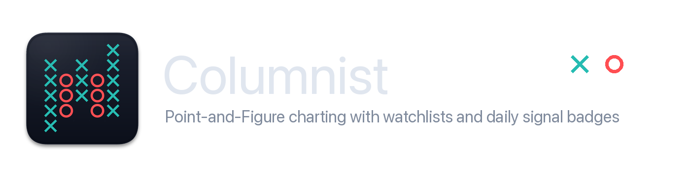

<p align="center">
  
</p>

# Columnist

An interactive Point-and-Figure (PnF) chart viewer for stocks, ETFs, futures, and crypto. Runs as a native desktop window via pywebview or in any browser.

## Features

- **170+ tickers** organized in a sidebar by category (ETFs, sectors, futures, crypto, stocks)
- **Custom watchlists** with persistent user-created lists
- **Daily PnF activity badges** next to symbols after scanning/loading a watchlist
- **Pan, zoom, and keyboard navigation** on a canvas-rendered PnF chart
- **Per-box date hover** — hover over any X or O to see when it was added, with same-day boxes highlighted
- **Per-ticker settings** — each ticker remembers its last-used box size and reversal count across sessions
- **Configurable parameters** — box size (0.25%–5%), reversal count (1–5), and date range presets
- **Standalone desktop builds** — builds for macOS and Windows via PyInstaller

## Running from source

Requires Python 3.10+.

```bash
pip install yfinance pywebview
python columnist.py             # native window (pywebview)
python columnist.py --browser   # opens in default browser
```

`pywebview` is optional — if not installed, the app automatically falls back to the browser.

## Building the standalone app

Build on the operating system you want to ship. PyInstaller does not cross-compile
between macOS and Windows.

### macOS

```bash
chmod +x build.sh
./build.sh
```

Creates a virtual environment, installs build dependencies, and produces `dist/Columnist.app` (~68 MB).

```bash
cp -r "dist/Columnist.app" /Applications/
```

**Build requirements:**
- macOS (uses `pywebview` with WebKit)
- Python 3.10+

No global package installs needed — the build script manages its own venv.

### Windows

Run from PowerShell:

```powershell
.\build_windows.ps1
```

Creates a virtual environment, installs build dependencies, and produces
`dist\Columnist\Columnist.exe`.

**Build requirements:**
- Windows 10/11
- Python 3.10+
- Microsoft Edge WebView2 Runtime, which is normally already installed on modern Windows

## Saved settings

Watchlists and per-ticker chart settings are saved outside the app bundle:

- macOS: `~/Library/Application Support/Columnist/settings.json`
- Windows: `%APPDATA%\Columnist\settings.json`

Existing settings from earlier `PnF Viewer` builds are loaded automatically.

## Keyboard shortcuts

| Key | Action |
|-----|--------|
| `R` | Reset / fit view |
| Arrow keys | Pan |
| `+` / `-` | Zoom in / out |
| `Home` / `End` | Jump to first / last column |
| Double-click | Fit view |
| Scroll wheel | Zoom at cursor |

## Project structure

```
columnist.py        Tiny Python server, JSON API, and desktop/browser launcher
index.html          Static app shell
style.css           App styling
js/app.js           Vanilla JavaScript app logic
icon.icns           macOS app icon
build.sh            Build script for standalone .app
build_windows.ps1   Build script for standalone Windows executable
Columnist.spec      PyInstaller spec file
assets/             README logo and icon source assets
tools/              Support utilities outside the packaged viewer runtime
```

## License

MIT — see [LICENSE](LICENSE).
